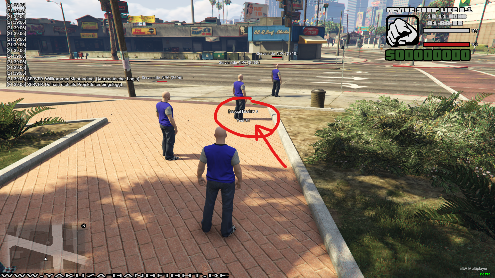

### events

- create3DTextLabel(text, posX, posY, posZ, drawDistance)
- update3DTextLabel(labelID, text, posX, posY, posZ, drawDistance)
- destroy3DTextLabel(labelID)

### important

- sendPlayerAll3DTextLabels(player) - use this event after player logging in

### preview
